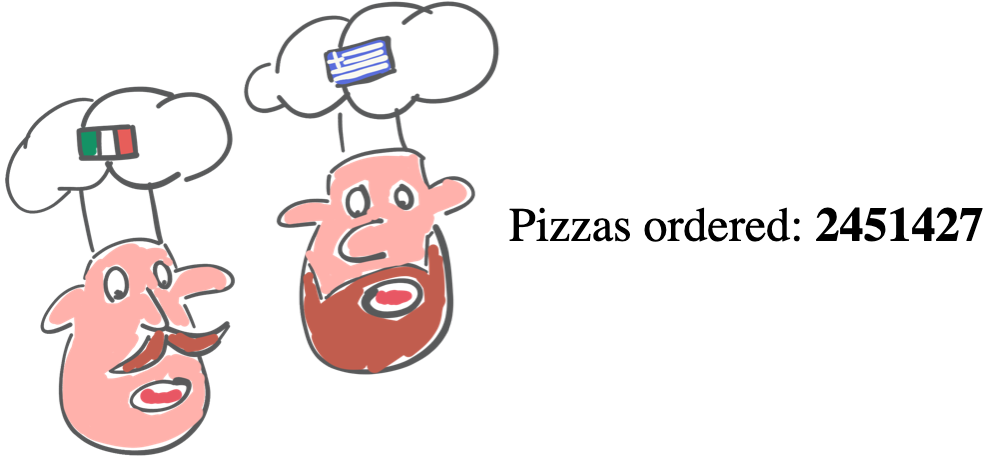

# Kafka Python Fake Data Producer

## Description

**Kafka Python Fake Data Producer** is a complete demo app allowing you to quickly produce a Python fake Pizza-based streaming dataset and push it to an Apache Kafka topic. It gives an example on how easy is to create great fake streaming data to feed Apache Kafka.

* **Apache Kafka**: a [distributed streaming platform](https://kafka.apache.org/)
* **Topic**: all Kafka records are organised into topics, you can think of a topic like an event log or a table if you're familiar with databases.
* **Kafka Producer**: an entity/application that publishes data to Kafka

An Apache Kafka cluster can be created in minutes in any cloud of your choice using [Aiven.io console](https://console.aiven.io/signup?utm_source=github&utm_medium=organic&utm_campaign=blog_art&utm_content=post).

For more informations about the code building blogs check the [blog post](https://aiven.io/blog/create-your-own-data-stream-for-kafka-with-python-and-faker?utm_source=github&utm_medium=organic&utm_campaign=blog_art&utm_content=post)

## News in 1.1

Version 1.1 enhanced the Kafka Pizza producer by
  * Including it in a Flask app
  * Adding mapping capability for the city of Milan and other 8 cities around Milan
    * Adding Latitude and Longitude together with the address (Please note that the address is completely random, so it wont match the longitude and latitude position)
  * Adding more controlled randomness about delivery positions

## Installation
This demo app is relying on [Faker](Python 3.5 and above), [kafka-python](https://kafka-python.readthedocs.io/en/master/usage.html) and [Flask](https://flask.palletsprojects.com/en/1.1.x/) which the former requiring Python 3.5 and above.
The installation can be done via

```bash
pip install faker
pip install kafka-python
pip install Flask
pip install numpy
```

## Usage

The Python code can be run in bash with the following

```bash
python main.py --cert-folder ~/kafkaCerts/ \
  --host kafka-<name>.aivencloud.com \
  --port 13041 \
  --topic-name pizza-orders \
  --nr-messages 0 \
  --max-waiting-time 0 \
  --flask-port 5000
```

Where
* `cert-folder`: points to the folder containing the Kafka certificates (see [blog post](https://aiven.io/blog/create-your-own-data-stream-for-kafka-with-python-and-faker?utm_source=github&utm_medium=organic&utm_campaign=blog_art&utm_content=post) for more)
* `host`: the Kafka host
* `port`: the Kafka port
* `topic-name`: the Kafka topic name to write to (the topic needs to be pre-created or `kafka.auto_create_topics_enable` parameter enabled)
* `nr-messages`: the number of messages to send
* `max-waiting-time`: the maximum waiting time in seconds between messages
* `flask-port`: the port number on which the Flask app will be available

Once executed the above command in the terminal, we can access the Flask app on the browser at

```
http://<HOST_IP>:<FLASK_PORT>/
```
Where
* `<HOST_IP>`: is the IP of the machine where the above command is executed (`127.0.0.1` if started locally)
* `<FLASK_PORT>`: is the port number (`flask-port`) passed during the call (e.g. 5000)

If the app is working successfully you should see at `http://<HOST_IP>:<FLASK_PORT>/` a web page like the following



With the counter initially at 0. Further refresh of the page should show the counter of pizzas increasing.

If successfully connected to a Kafka cluster, the command will output a number of messages (`nr-messages` parameter) that are been sent to Kafka in the form

```json
{
  "schema": {
    "type": "struct",
    "fields": [{
        "type": "int32",
        "optional": false,
        "field": "id"
    }, {
        "type": "string",
        "optional": false,
        "field": "shop"
    }, {
        "type": "string",
        "optional": false,
        "field": "name"
    }, {
        "type": "string",
        "optional": false,
        "field": "phoneNumber"
    }, {
        "type": "string",
        "optional": false,
        "field": "address"
    },{
        "type": "string",
        "optional": false,
        "field": "city"
    },{
        "type": "float",
        "optional": false,
        "field": "lat"
    },{
        "type": "float",
        "optional": false,
        "field": "long"
    },{
        "type": "int64",
        "optional": false,
        "name": "org.apache.kafka.connect.data.Timestamp",
        "field": "order_time"
    },
    {
        "type": "float",
        "optional": false,
        "field": "total_amount"
    },
    {
        "type": "string",
        "optional": false,
        "field": "card_number"
    },
    {
        "optional": false,
        "field": "pizzas",
        "type": "array",
        "items":
            {
                "type": "struct",
                "optional": false,
                "fields": [
                    {
                        "type": "string",
                        "optional": false,
                        "field": "pizzaName",
                    }
                    ,{
                        "type": "array",
                        "optional": true,
                        "field": "additionalToppings",
                        "items": {"type": "string"}
                    }
                ]
            }
    }
    ],
    "optional": false,
    "name": "foobar"
  },
  "payload":{
    "id": 0,
    "shop": "Mario’s Pizza",
    "name": "Arsenio Pisaroni-Boccaccio",
    "phoneNumber": "+39 51 0290746",
    "address": "Canale Ritacca 27",
    "city": "Milano",
    "lat": 275.91,
    "long": 527.88,
    "order_time": 1614776450840,
    "total_amount": 5050.48,
    "card_number": "502082734935",
    "pizzas": [
      {"pizzaName": "Margherita", "additionalToppings": [ "olives","anchovies","mushrooms"] },
      {"pizzaName": "Diavola", "additionalToppings": ["strawberry"] }
      ]
  }
}
```

With
* `id`: being the order number, starting from `0` until `nr-messages -1`
* `shop`: is the pizza shop name receiving the order, you can check and change the full list of shops in the `pizza_shop` function within [pizzaproducer.py](pizzaproducer.py)
* `name`: the caller name
* `phoneNumber`: the caller phone number
* `address`: the caller address
* `city`: the name of the city, the list of city names can be found in `pizzaproducer.py`
* `lat` and `long`: latitude and longitude of the address
* `order_time`: the order time in linux format
* `total_amount`: total amount of the order in Euros
* `card_number`: credit card number used to pay
* `pizzas`: an array or pizza orders made by
  * `pizzaName`: the name of the basic pizza in the range from 1 to `MAX_NUMBER_PIZZAS_IN_ORDER` defined in [main.py](main.py), the list of available pizzas can be found in the `pizza_name` function within [pizzaproducer.py](pizzaproducer.py)
  * `additionalToppings`: an optional number of additional toppings added to the pizza in the range from 0 to `MAX_ADDITIONAL_TOPPINGS_IN_PIZZA` , the list of available toppings can be found in the `pizza_topping` function within [pizzaproducer.py](pizzaproducer.py)

# Starting your Kafka Service with Aiven.io

If you don't have a Kafka Cluster available, you can easily start one in [Aiven.io console](https://console.aiven.io/signup?utm_source=github&utm_medium=organic&utm_campaign=blog_art&utm_content=post).

Once created your account you can start your Kafka service with [Aiven.io's cli](https://github.com/aiven/aiven-client)

Set your variables first:
```bash
KAFKA_INSTANCE_NAME=fafka-my
PROJECT_NAME=my-project
CLOUD_REGION=aws-eu-south-1
AIVEN_PLAN_NAME=business-4
DESTINATION_FOLDER_NAME=~/kafkacerts
```
Parameters:
* `KAFKA_INSTANCE_NAME`: the name you want to give to the Kafka instance
* `PROJECT_NAME`: the name of the project created during sing-up
* `CLOUD_REGION`: the name of the Cloud region where the instance will be created. The list of cloud regions can be found
 with
```bash
avn cloud list
```
* `AIVEN_PLAN_NAME`: name of Aiven's plan to use, which will drive the resources available, the list of plans can be found with
```bash
avn service plans --project <PROJECT_NAME> -t kafka --cloud <CLOUD_PROVIDER>
```
* `DESTINATION_FOLDER_NAME`: local folder where Kafka certificates will be stored (used to login)

You can create the Kafka service with

```bash
avn service create  \
  -t kafka $KAFKA_INSTANCE_NAME \
  --project $PROJECT_NAME \
  --cloud  $CLOUD_PROVIDER \
  -p $AIVEN_PLAN_NAME \
  -c kafka_rest=true \
  -c kafka.auto_create_topics_enable=true \
  -c schema_registry=true
```

---

You can download the required SSL certificates in the `<DESTINATION_FOLDER_NAME>` with

```bash
avn service user-creds-download $KAFKA_SERVICE_NAME \
  --project $PROJECT_NAME    \
  -d $DESTINATION_FOLDER_NAME \
  --username avnadmin
```

And retrieve the Kafka Service URI with

```bash
avn service get $KAFKA_SERVICE_NAME \
  --project $PROJECT_NAME \
  --format '{service_uri}'
```

The Kafka Service URI is in the form `hostname:port` and provides the `hostname` and `port` needed to execute the code.
You can wait for the newly created Kafka instance to be ready with

```bash
avn service wait $KAFKA_SERVICE_NAME --project $PROJECT_NAME
```

For a more detailed description of services and required credentials, check the [blog post](blogs.aiven.io)

## No Pizza? No Problem!

The demo app produces pizza data, however is very simple to change the dataset produced to anything else.
The code is based on [Faker](https://faker.readthedocs.io/en/master/), an Open Source Python library to generate fake data.

To modify the data generated, change the `produce_pizza_order` function within the `main.py` file. The output of the function should be two python dictionaries, containing the event `key` and `message`

```python
def produce_pizza_order (ordercount = 1):
    message = {
        'name': fake.unique.name(),
        'phoneNumber': fake.phone_number(),
        'address': fake.address()
      }
    key = {'order' = ordercount}
    return message, key
```

To customise your dataset, you can check Faker's providers in the [related doc](https://faker.readthedocs.io/en/master/providers.html)
